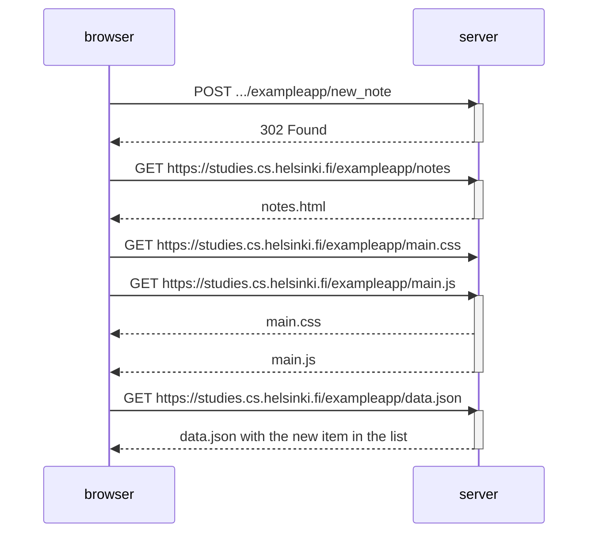

```mermaid
sequenceDiagram
    participant browser
    participant server

    browser->>server: POST .../exampleapp/new_note
    activate server
    server-->>browser: 302 Found
    deactivate server


    browser->>server: GET https://studies.cs.helsinki.fi/exampleapp/notes
    activate server
    server-->>browser: notes.html
    deactivate server

    browser->>server: GET https://studies.cs.helsinki.fi/exampleapp/main.css
    browser->>server: GET https://studies.cs.helsinki.fi/exampleapp/main.js
    activate server
    server-->>browser: main.css
    server-->>browser: main.js
    deactivate server


    browser->>server: GET https://studies.cs.helsinki.fi/exampleapp/data.json
    activate server
    server-->>browser: data.json with the new item in the list
    deactivate server

```
